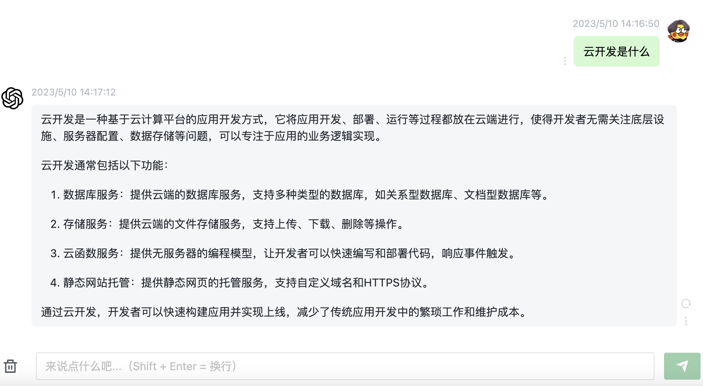

本文主要解决三个问题 ：   
- 云开发是什么    
- 我们为什么需要云开发  
- 如何快速上手地表最强云开发 Laf（https://laf.run）

 ## 云开发是什么？
 我们来看看 GPT 怎么说。
 
 
 
一句话总结：云开发是一种模式，区别于传统开发，传统开发有的东西，云开发都有，传统开发能实现的，云开发也都能实现。

那么第二个问题就来了，既然都有都能实现，我们为什么需要**云开发**？

## 我们为什么需要云开发？

为了搞懂这个问题，我们需要先知道传统的开发流程以及所需要的技术栈，我们这里以云开发中的战斗机 Laf（laf.run）举例。

```
传统开发流程：
          1.购买服务器
          2.配置服务器的环境数据库等
          3.编写接口代码
          4.把代码部署到服务器
          5.前端搞定剩余工作 
          6.前端项目打包部署到服务器
          7.后续运维工作
云开发流程：
          1.打开浏览器编写接口代码
          2.前端搞定剩余工作
          3.项目一键托管上线到云平台
          
传统开发所需技术栈：
          1.一门后端语言
          2.后端框架
          3.数据库
          4.缓存技术
          5.操作系统相关
          6.前端三件套+框架+常用库
               
云开发所需技术栈：
          1.云开发的数据库和文件操作
          2.前端三件套+框架+常用库
```

               
了解这些之后，我想根本不需要明白这些实现细节，单单从字数上就可以感受到，云开发模式和传统开发模式之间的区别。

> 简单总结一下就是三省：省心省力又省钱。

用 `Laf`，前端我们用 `js/ts` 来写代码，后端接口我们还是用 `js/ts` 来写代码，这意味着什么？这意味着只需要掌握一门开发语言，就可以前后端通杀了，这意味着前端工程师可以瞬间变成全栈开发，意味着前端和后端再也不用吵架了。

用 `Laf`，可以节约服务器运维，多环境部署，告别配置调试 `nginx` ，告别为每个项目手动部署数据库和安全顾虑，告别 `coding` 一分钟发布半小时的尴尬场景等等。

什么环境配置我不懂，我只需要一台能打开浏览器的电脑就可以一把梭。
 
>用了 `Laf` 之后上线接口可以是分钟级的，上线应用可以是小时级的。

就我个人来说，我一个人用 `Laf` 云开发一个月的时间交付了整套价值八万的教育系统（UI设计除外），一个小时搭建的 `ChatGPT` 网页也有上百付费用户，像其他更优秀的案例还有两名大学生用 `Laf` 一夜写完的 `ChatMind` 已经月入两万。

那么，到这里，我们应该已经找到了为什么需要使用云开发的答案。

`Laf` 云开发带来的开发体验犹如德芙般丝滑，其高效的开发效率和更低的开发门槛是传统开发无法比拟的。

用完 `Laf` 后我的内心只有一句话，**天下苦开发者久矣！**

## 如何快速上手地表最强云开发 Laf（https://laf.run）
 1.Laf 官方提供了详细的开发文档（https://doc.laf.run）   
 2.关注我的 B站：3分钟实验室 

接下来，我会通过视频的方式，在 B 站更新 `Laf` 云开发的全套教程，包括各种实战案例。包教包会，让每个开发者都能坐上 `Laf` 这架战斗机✈️！

### life is short, you need laf :)